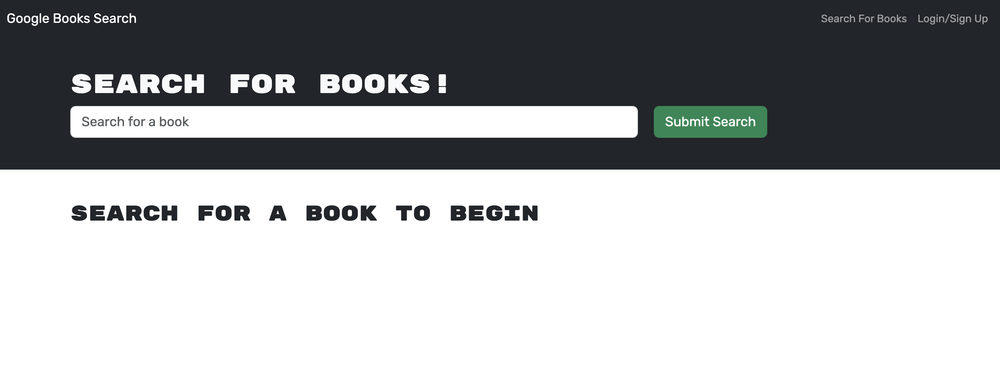
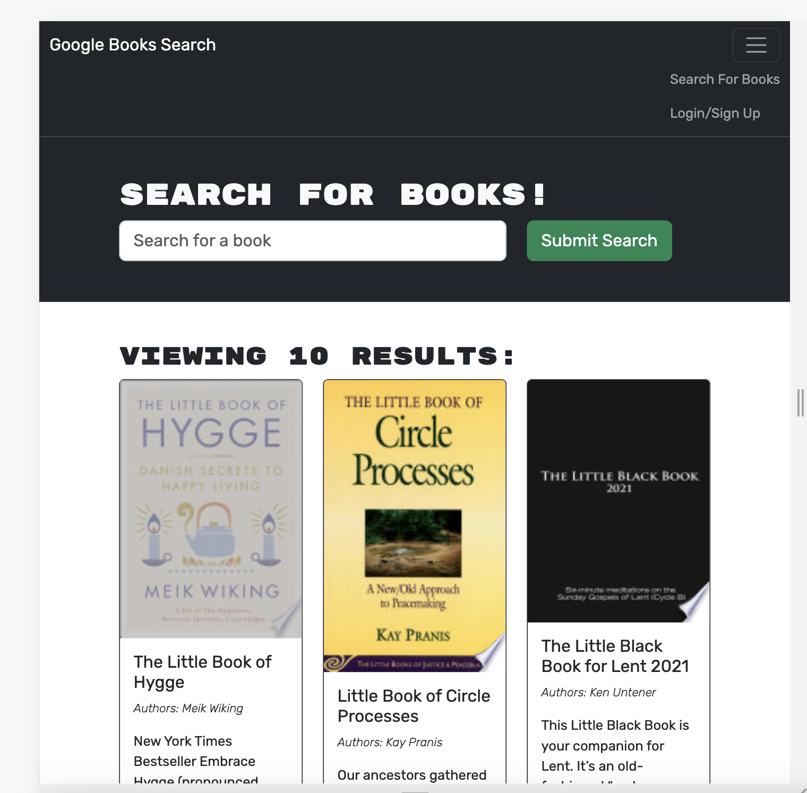
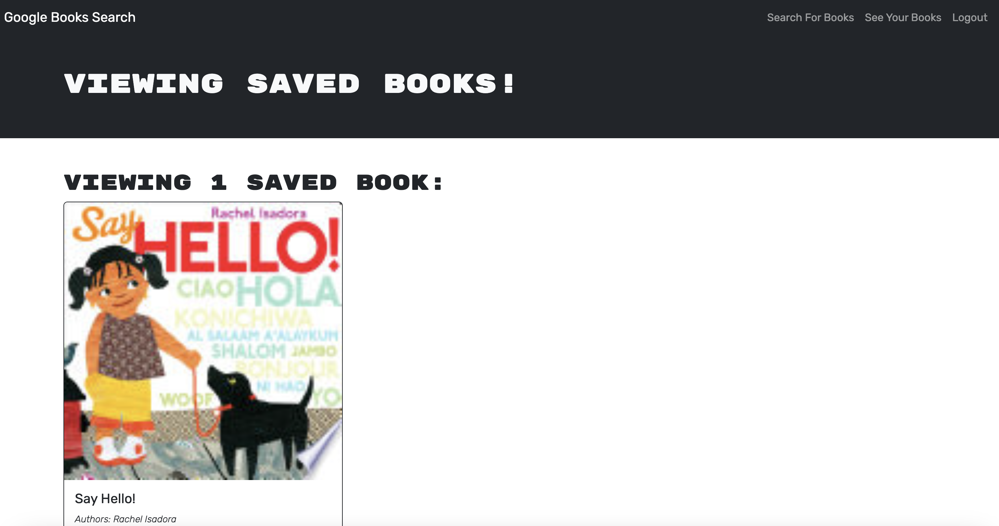

# Book Search Engine

## Description
This application is a book search engine that allows you to search a book and save it for future reference. It was built using and Apollo server and GraphQL queries with mongoDB as the database. 

## Installation
N/A

## Usage
A user must navigate to the website by clicking on the heroku link provided. Once there, the user will see a homepage which displays a webpage with a search bar that allows you to search for a book. There is also the option to login/sign-up if a user is new to the website.

Once you enter a title and press submit, 10 options will appear with the book title, an image, authors, and a description of the book. If you are logged into the website, you will also see a blue button with the option to save the book. 

Logged in users will see a link on the top of the screen called "See Your Books". This allows the logged in users to view there saved books. There is also the option to delete any saved books if you no longer want that book included in your list. 

Below is a link to the deployed application:

https://book-search-engine-jacone626-f3277d2c06ef.herokuapp.com/

## Credits

N/A

## License
Please refer to the license in the repo.
